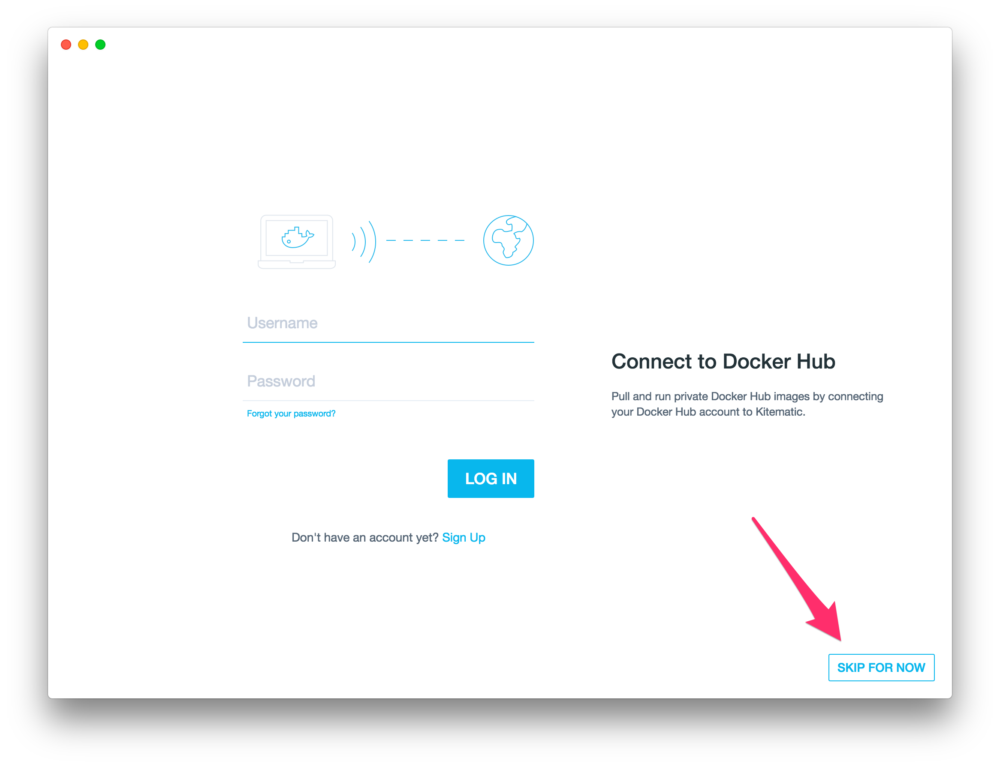
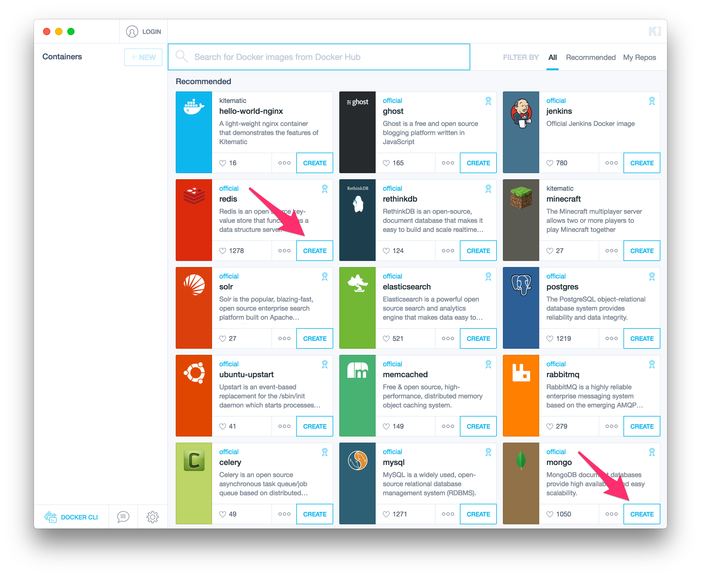
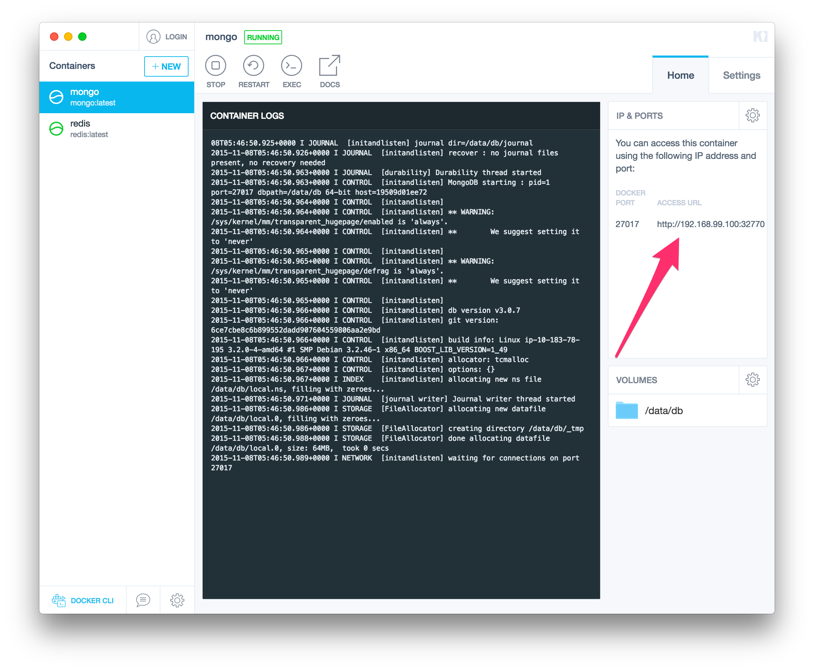

# Инструкция по запуску сервера

## Установка `docker toolbox`

Перейти по [ссылке](https://www.docker.com/docker-toolbox) и скачать установщик для вашей ОС. Из всего пакета нам главным образом понадобится очень классная и полезная программа `kitematic`.

## Работа с `kitematic`

### Откройте `kitematic`

Если у вас есть аккаунт на [Docker Hub](https://hub.docker.com/) вы можете просто залогиниться, в противном случае смело жмите "SKIP FOR NOW".



### Веберите образы которые вам нужны

Например, если нам нужны `redis` и `mongodb` мы должны нажать на кнопку "CREATE" на них обоих. Для запуска серверной части нашего проекта достаточно только `mongodb`. Если нужной БД нет в списке, можно вписать ее название в строку поиска.

 :exclamation: **Обратите внимание, что создание контейнеров производится только один раз. При последующих запусках этот шаг нужно пропустить.**



### Получение информации для подключения

Теперь вы можете получить настройки подключения к БД. Обратите внимание, что в случае перезагрузки компьютера контейнеры автоматически остановятся и их необходимо будет запустить, нажав на кнопку "START". Так же, имейте ввиду, что в случае перезапуска контейнера строка подключения может поменяться.



## Запуск сервера

### Конфигурация

В корне папки `server` есть файл `.env` следующего формата

```ini
DB_HOST=localhost
DB_NAME=insta
DB_PORT=27017
```

Необходимо его заполнить в соответствии с той строкой подключения, которую вы получили на предыдущем шаге. Например, если строка подключения выглядит так `http://192.168.99.100:32770`, то в файл пишем следующее:

```ini
DB_HOST=192.168.99.100
DB_NAME=insta
DB_PORT=32770
```

Параметр `DB_NAME` можно не менять. База данных при запуске создастся автоматически, так что вручную создавать тоже ничего не требуется.

### Наполнение базы

Если хотите наполнить базу фейковыми данными, можно выполнить команду `npm run server:seeds`. Команда удаляет из базы, все что касается фото и пользователей и генерирует новые.

### Запуск

Ура! Теперь мы готовы запустить сервер. Это можно сделать либо отдельно командой `npm run server:start`, либо вместе с клиентом (команда `npm start` запускает и клиентскую и серверную часть).

 :exclamation: **Помните, что БД должна быть обязательно активна в момент запуска сервера.**
